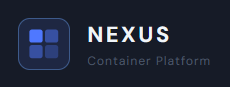
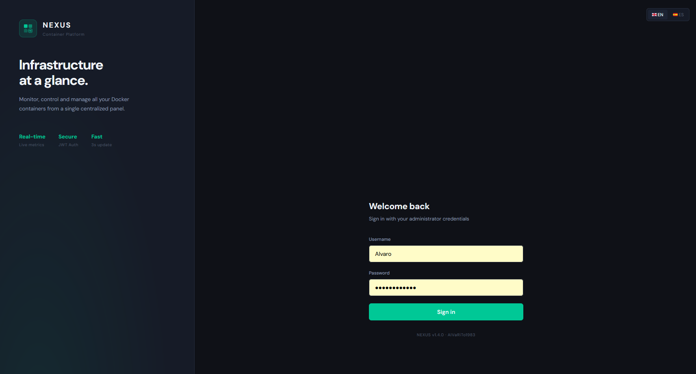
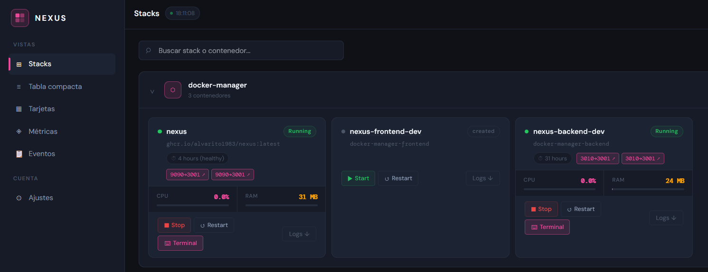
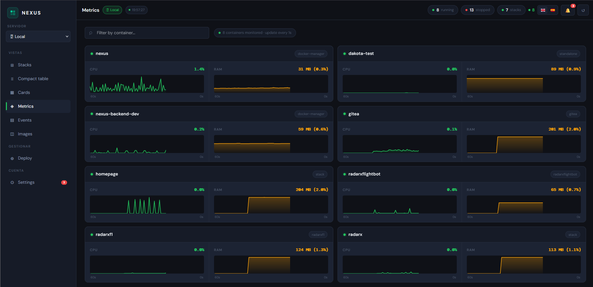
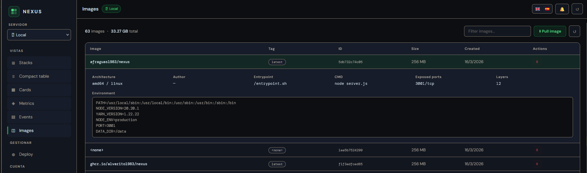
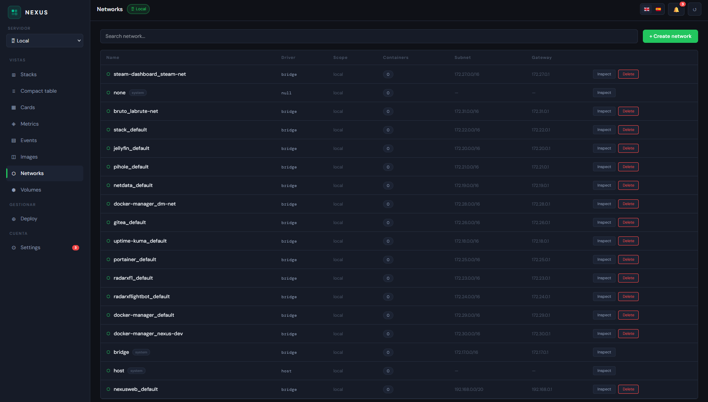
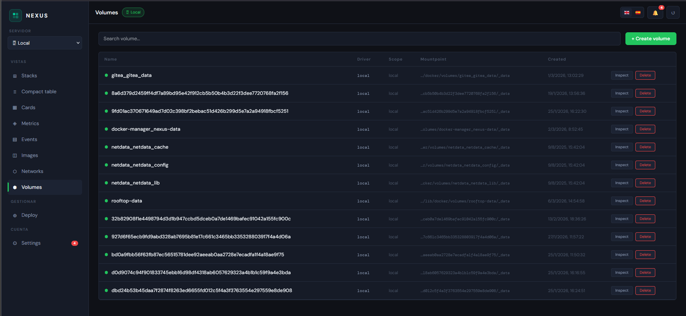
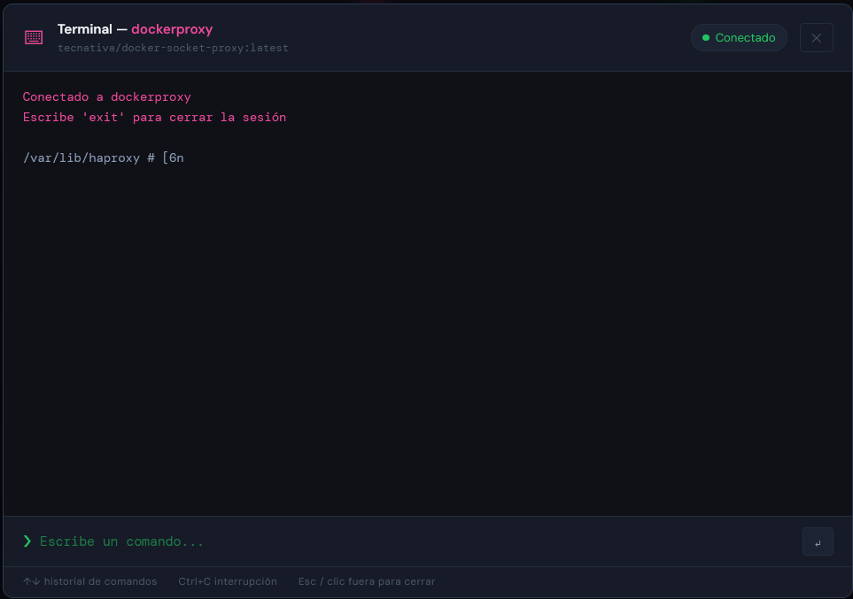
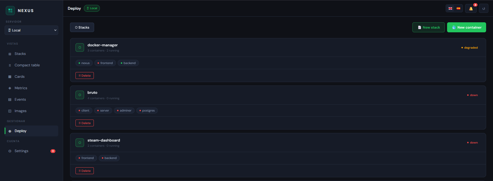

<div align="center">



# NEXUS

**A lightweight, beautiful Docker management panel — built as an alternative to Portainer.**

[](LICENSE)
[](https://hub.docker.com/r/afraguas1983/nexus)
[](https://hub.docker.com/r/afraguas1983/nexus)
[](https://hub.docker.com/_/node)
[](https://react.dev)
[](https://alvarito1983.github.io/nexus-web)

[alvarito1983.github.io/nexus-web](https://alvarito1983.github.io/nexus-web) · [Docker Hub](https://hub.docker.com/r/afraguas1983/nexus) · [Report Bug](https://github.com/Alvarito1983/NEXUS/issues)

</div>

---

## ✨ Features

- 📊 **Real-time metrics** — CPU & RAM per container with 60s sparkline history
- 📦 **Stack view** — containers grouped by docker-compose project with health status
- 🗂️ **Compact table** — dense `docker ps`-style view with sortable columns
- 💻 **Integrated terminal** — `docker exec` shell directly from the browser
- 🖼️ **Image management** — list, inspect, pull from Docker Hub, delete
- 🌐 **Network management** — list, create, delete, inspect Docker networks
- 💾 **Volume management** — list, create, delete, inspect Docker volumes
- 🔒 **Multi-user** — Admin and Viewer roles with JWT authentication
- 🌍 **Full EN/ES i18n** — English and Spanish UI
- 📱 **PWA + mobile responsive** — works on phone and tablet
- 🔔 **Telegram alerts** — instant notifications on container down events
- 📋 **Event history** — full log of container lifecycle events
- 🚀 **Stack deploy** — deploy docker-compose stacks from the UI with YAML editor
- 🔍 **Docker Scout** — CVE scanning integrated directly in image management
- 🖥️ **Multi-host** — manage multiple Docker hosts via NEXUS Proxy agent

---

## Quickstart

```bash
docker run -d \
  --name nexus \
  -p 9090:9090 \
  -v /var/run/docker.sock:/var/run/docker.sock \
  afraguas1983/nexus:latest
```

Or with Docker Compose:

```bash
git clone https://github.com/Alvarito1983/NEXUS.git
cd NEXUS
cp .env.example .env
docker compose up -d
```

Open **http://localhost:9090** — default credentials: `admin` / `admin`

---

## 🗺️ Roadmap

### v1.5.1 — Current ✅
- Vite migration (eliminated all frontend CVEs)
- node:24-alpine base image
- Networks & Volumes management
- Docker Scout CVE integration
- Full EN/ES i18n
- PWA support

### v1.6.0 — Watcher integration _(coming soon)_
- Updates widget on dashboard showing pending image updates
- One-click update and rollback from NEXUS UI
- Integration with NEXUS Watcher API

### v2.0.0 — NEXUS Ecosystem 🚀 _(Q4 2026)_

The big one. NEXUS becomes the central hub of the **NEXUS Ecosystem** — a suite of modular, standalone Docker management tools that integrate seamlessly when used together.

> *"Each tool works. Together, they think."*

Inspired by the Apple ecosystem philosophy: every product is complete on its own, but together they create an experience no competitor can replicate. A single environment variable (`NEXUS_URL`) is all it takes to activate full integration.

```
NEXUS OS              — Unified dashboard, SSO, service registry
├── NEXUS             — Docker manager          :9090  ✅ live
├── NEXUS Watcher     — Update detection        :9091  ✅ live
├── NEXUS Pulse       — Uptime & health         :9092  🔜 Q3 2026
├── NEXUS Security    — CVEs, SSL, 2FA, audit   :9093  🔜 Q3 2026
├── NEXUS Notify      — Unified alert router    :9094  🔜 Q2 2026
└── NEXUS Proxy       — Docker socket proxy     :2375  ✅ live
```

**NEXUS OS** sits above all tools as the unified control plane:
- Single dashboard aggregating data from all ecosystem tools
- Single sign-on — one login for everything
- Centralised configuration propagated to all tools
- Service registry — automatic discovery of running ecosystem components
- Health overview of the entire homelab at a glance

**Each tool is standalone.** No tool requires another to function. Integration activates automatically when `NEXUS_URL` is set.

### v3.0.0 — SaaS & Multi-tenant _(2027)_
- Cloud-hosted NEXUS OS
- Multiple organisations and teams
- Free / Pro / Business plans
- Managed updates and SLA guarantee
- Usage-based billing

---

## 📸 Screenshots

| Login | Dashboard |
|-------|-----------|
|  |  |

| Metrics | Images |
|---------|--------|
|  |  |

| Networks | Volumes |
|----------|---------|
|  |  |

| Terminal | Deploy |
|----------|--------|
|  |  |

---

## Tech stack

- **Backend** — Node.js 24, Express, Socket.io, Dockerode
- **Frontend** — React 18, Vite
- **Base image** — `node:24-alpine`
- **Auth** — JWT, multi-user with Admin/Viewer roles

---

<div align="center">

Made with ☕ by [Alvarito1983](https://github.com/Alvarito1983)

</div>
